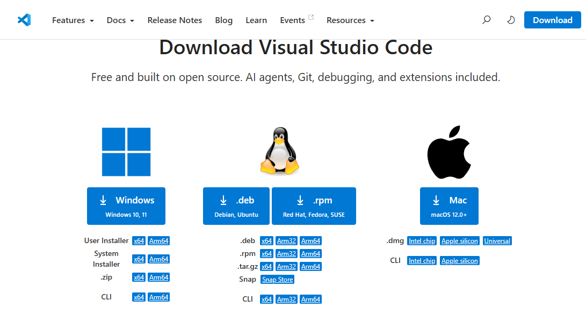

# Python und Visual Studio Code installieren

In dieser Anleitung richtest du deinen Computer für den Python-Kurs ein. Am Ende kannst du in Visual Studio Code ein erstes Python-Programm schreiben und ausführen.

> **Zeitbedarf:** ungefähr 20–30 Minuten  
> **Du benötigst:** einen Computer mit Windows oder macOS und eine Internetverbindung

## Das installieren wir

Für den Kurs benötigen wir drei Bestandteile:

1. **Python** führt unsere Programme aus.
2. **Visual Studio Code**, kurz **VS Code**, ist unser Programmiereditor.
3. Die **Python-Erweiterung für VS Code** verbindet den Editor mit Python.

Später installieren wir zusätzlich **Pygame Zero**, um grafische Spiele zu programmieren.

---

## Teil 1: Python installieren


### Windows

1. Öffne die offizielle Seite [python.org/downloads](https://www.python.org/downloads/).
2. Lade die aktuelle stabile Version von **Python 3** für Windows herunter.
3. Öffne die heruntergeladene Installationsdatei.
4. Starte die empfohlene Standardinstallation.
5. Warte, bis die Installation abgeschlossen ist.

> **Wichtig:** Falls der Installer die Option **Add Python to PATH** anzeigt, aktiviere sie. Dadurch kann Windows Python später im Terminal finden.

### macOS

1. Öffne [python.org/downloads](https://www.python.org/downloads/).
2. Lade die aktuelle stabile Version von **Python 3** für macOS herunter.
3. Öffne die heruntergeladene `.pkg`-Datei.
4. Folge dem Installationsassistenten und verwende die vorgeschlagenen Einstellungen.

### Installation kontrollieren

Öffne unter Windows **PowerShell** beziehungsweise unter macOS das **Terminal**.

Gib unter Windows ein:

```powershell
python --version
```

Falls dieser Befehl nicht funktioniert, versuche:

```powershell
py --version
```

Gib unter macOS ein:

```bash
python3 --version
```

Du solltest eine Ausgabe ähnlich wie diese erhalten:

```text
Python 3.x.x
```

Die genauen Zahlen dürfen anders aussehen. Entscheidend ist, dass die Version mit `3` beginnt.

---

## Teil 2: Visual Studio Code installieren



1. Öffne [code.visualstudio.com](https://code.visualstudio.com/).
2. Lade die passende Version für dein Betriebssystem herunter.
3. Öffne die Installationsdatei.
4. Übernimm die vorgeschlagenen Einstellungen.
5. Starte **Visual Studio Code**.

Unter Windows sind folgende zusätzliche Optionen praktisch, falls sie angezeigt werden:

- **Add to PATH**
- **Open with Code** zum Kontextmenü hinzufügen
- VS Code als Editor für unterstützte Dateitypen registrieren

---

## Teil 3: Python-Erweiterung installieren

1. Öffne VS Code.
2. Klicke links auf das Symbol **Extensions** mit den vier Kästchen.
3. Alternativ kannst du die Tastenkombination `Ctrl` + `Shift` + `X` verwenden. Auf dem Mac ist es `Cmd` + `Shift` + `X`.
4. Suche nach `Python`.
5. Installiere die Erweiterung **Python** des Herausgebers **Microsoft**.

Die Erweiterung ergänzt unter anderem:

- farbige Darstellung von Python-Code,
- automatische Codevorschläge,
- Fehlermeldungen und Hinweise,
- Ausführen von Python-Dateien,
- Debugging zum schrittweisen Untersuchen eines Programms.

> Installiere nicht wahllos mehrere Python-Erweiterungen. Für den Kurs genügt zunächst die offizielle Erweiterung von Microsoft.

---

## Teil 4: Einen Kursordner anlegen

Speichere deine Programme nicht irgendwo zwischen Downloads und Dokumenten. Erstelle einen eigenen Kursordner.

1. Erstelle in deinen Dokumenten einen Ordner namens `python-kurs`.
2. Wähle in VS Code **File → Open Folder** beziehungsweise **Datei → Ordner öffnen**.
3. Öffne den Ordner `python-kurs`.
4. Bestätige bei einer Sicherheitsabfrage, dass du diesem selbst erstellten Ordner vertraust.

Im Explorer auf der linken Seite sollte nun der Ordner `python-kurs` erscheinen.

---

## Teil 5: Das erste Python-Programm

### Datei erstellen

1. Klicke im VS-Code-Explorer auf **New File**.
2. Nenne die Datei `hallo.py`.

Die Endung `.py` zeigt, dass es sich um eine Python-Datei handelt.

### Programm schreiben

Schreibe folgende Zeile in die Datei:

```python
print("Hallo Python!")
```

Speichere die Datei mit `Ctrl` + `S` beziehungsweise auf dem Mac mit `Cmd` + `S`.

### Python-Interpreter auswählen

Der **Interpreter** ist das Programm, das deinen Python-Code ausführt.

1. Öffne die Befehlspalette mit `Ctrl` + `Shift` + `P` beziehungsweise `Cmd` + `Shift` + `P`.
2. Suche nach `Python: Select Interpreter`.
3. Wähle die installierte Python-3-Version aus.

Häufig zeigt VS Code die gewählte Version danach unten in der Statusleiste an.

### Programm starten

Klicke oben rechts im Editor auf die dreieckige Schaltfläche **Run Python File**.

VS Code öffnet unten ein Terminal. Dort sollte stehen:

```text
Hallo Python!
```

🎉 Gratulation! Du hast dein erstes Python-Programm ausgeführt.

---

## Teil 6: Ein kleines interaktives Programm

Ersetze den Inhalt von `hallo.py` durch:

```python
name = input("Wie heisst du? ")
print(f"Hallo {name}, willkommen im Python-Kurs!")
```

Starte die Datei erneut. Klicke ins Terminal, gib deinen Namen ein und bestätige mit der Eingabetaste.

### Was geschieht hier?

| Code              | Bedeutung                                        |
| ----------------- | ------------------------------------------------ |
| `input(...)`      | Zeigt eine Frage an und wartet auf eine Eingabe. |
| `name = ...`      | Speichert die Eingabe in der Variable `name`.    |
| `print(...)`      | Gibt Text im Terminal aus.                       |
| `f"...{name}..."` | Setzt den gespeicherten Namen in den Text ein.   |

---

## Teil 7: Pygame Zero installieren

Pygame Zero benötigen wir erst für das grafische Spiel **Catch & Dodge**. Die Installation kann deshalb auch gemeinsam im Unterricht erfolgen.

1. Öffne in VS Code über **Terminal → New Terminal** ein neues Terminal.
2. Gib unter Windows ein:

```powershell
python -m pip install pgzero
```

Wenn du Python über den Befehl `py` gestartet hast, verwende stattdessen:

```powershell
py -m pip install pgzero
```

Unter macOS verwendest du:

```bash
python3 -m pip install pgzero
```

3. Kontrolliere die Installation:

```powershell
python -m pgzero --version
```

Unter macOS lautet der Befehl entsprechend:

```bash
python3 -m pgzero --version
```

> Pygame Zero wird offiziell als Paket `pgzero` installiert. Dabei wird auch das benötigte Pygame mitinstalliert.

---

## Häufige Probleme

### `python` wurde nicht gefunden

- Schliesse VS Code vollständig und öffne es erneut.
- Probiere unter Windows `py --version`.
- Kontrolliere, ob Python wirklich installiert wurde.
- Installiere Python nochmals und aktiviere **Add Python to PATH**, falls diese Option angeboten wird.

### VS Code zeigt «Select Interpreter»

Öffne die Befehlspalette und wähle über **Python: Select Interpreter** deine Python-3-Installation aus.

### Die Run-Schaltfläche fehlt

Kontrolliere:

- Ist die Datei mit `.py` gespeichert?
- Ist die Erweiterung **Python von Microsoft** installiert?
- Wurde ein Python-Interpreter ausgewählt?

### `pip` wurde nicht gefunden

Verwende nicht nur `pip`, sondern rufe es über Python auf:

```powershell
python -m pip install pgzero
```

Unter Windows kann auch Folgendes funktionieren:

```powershell
py -m pip install pgzero
```

### Das Programm läuft, aber ich kann nichts eingeben

Klicke unten in das **Terminal** und nicht in das Fenster **Output/Ausgabe**. Programme mit `input()` benötigen das Terminal.

---

## Abschlusskontrolle

Setze einen Haken, wenn der Schritt funktioniert:

- [ ] Python 3 ist installiert.
- [ ] `python --version`, `py --version` oder `python3 --version` zeigt eine Version an.
- [ ] VS Code ist installiert.
- [ ] Die Erweiterung **Python von Microsoft** ist installiert.
- [ ] Der Ordner `python-kurs` ist in VS Code geöffnet.
- [ ] Der richtige Python-Interpreter ist ausgewählt.
- [ ] `hallo.py` gibt `Hallo Python!` aus.
- [ ] Das Programm mit `input()` kann deinen Namen einlesen.
- [ ] Pygame Zero ist installiert oder wird später gemeinsam installiert.

Wenn alle Pflichtpunkte erfüllt sind, bist du bereit für den Python-Kurs.

---

## Hinweise für die Lehrperson

- Python und VS Code nach Möglichkeit vor dem ersten Kurstag installieren lassen.
- Für die Installationskontrolle fünf Minuten zu Beginn einplanen.
- Auf Schulgeräten vorab prüfen, ob Installationen und `pip` durch Richtlinien blockiert werden.
- Für alle Lernenden dieselbe Ordnerstruktur verwenden.
- Pygame Zero erst installieren, wenn es im Kurs benötigt wird.
- Bei Problemen zuerst Interpreter, Terminalbefehl und Dateiendung kontrollieren.

## Quellen und weiterführende Anleitungen

- [Offizielles Python-Downloadportal](https://www.python.org/downloads/)
- [Offizieller Python-Einstieg in VS Code](https://code.visualstudio.com/docs/python/python-tutorial)
- [Offizielle Python-Dokumentation für Windows](https://docs.python.org/3/using/windows.html)
- [Offizielle Python-Dokumentation für macOS](https://docs.python.org/3/using/mac.html)
- [Offizielle Installationsanleitung für Pygame Zero](https://pygame-zero.readthedocs.io/en/latest/installation.html)
- [DataCamp: Setting Up VS Code for Python](https://www.datacamp.com/tutorial/setting-up-vscode-python)
